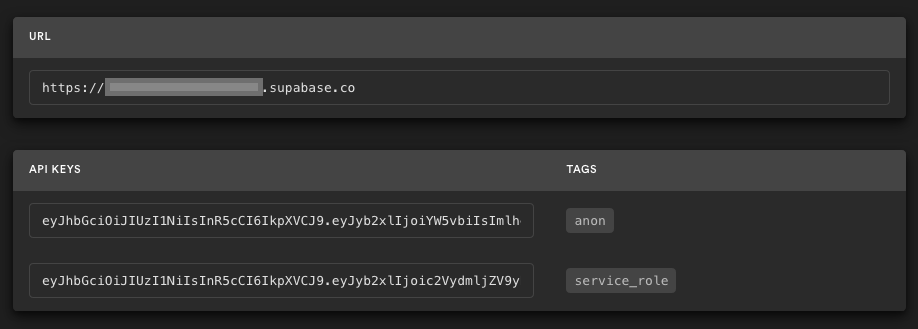
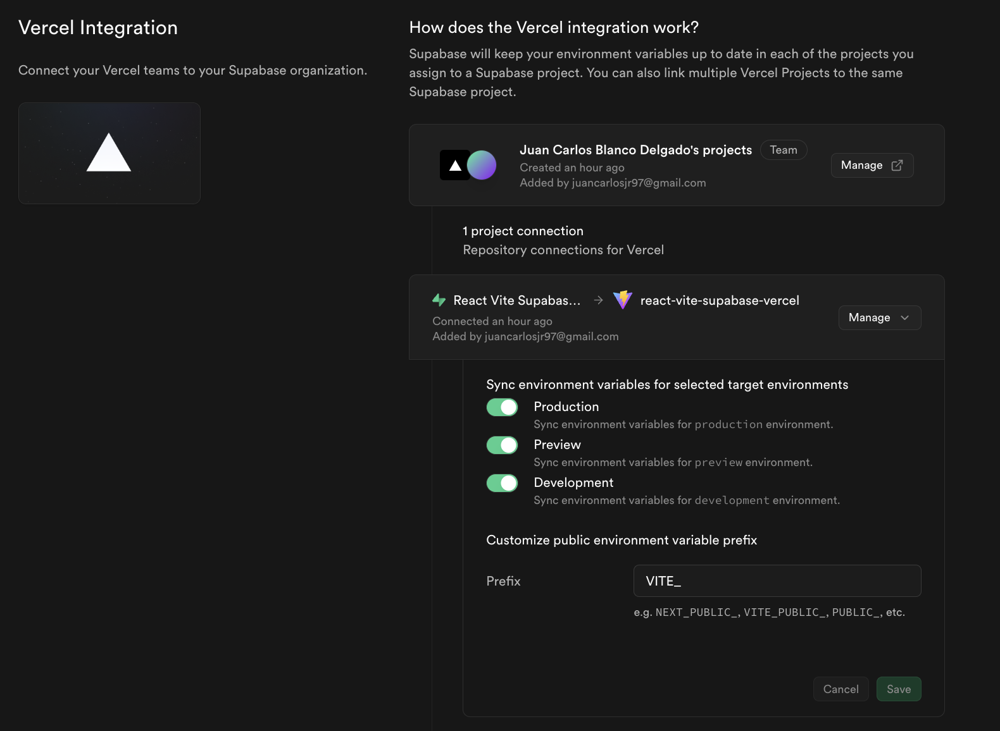

# React Vite Supabase Vercel | Template Project

This is a template project that demonstrates the usage of [React](https://react.dev/), [Vite](https://vite.dev/), [Supabase](https://supabase.com/), and [Vercel](https://vercel.com/).

## Demo

The demo is available [here](https://react-vite-supabase-vercel.vercel.app/).

## Features

- Sign in
- Sign up
- Todo - Create, Update, and Delete created by the user
- Todo - Public view of all todos created

## Deployment

Since Supabase requires a paid plan to enable GitHub and Supabase automated integration, the Supabase configuration must be done manually as a one-time task during setup.

### Supabase - Part 1

1. Create a new Supabase project

   Sign up for Supabase at https://supabase.com/dashboard and create a new project. Wait for the project to be up and running.

2. Run the migrations available from the [migration directory](./supabase/migrations/)

   For instructions on how to do this, see [here](https://supabase.com/docs/guides/database/overview#the-sql-editor).

3. Get the URL and Key for the Supabase project

   Go to the Project Settings (the cog icon), open the API tab, and find your API URL and `anon` key. You'll need these in the next step.

   The `anon` key is your client-side API key. It allows "anonymous access" to your database until the user has logged in. Once they have logged in, the keys will switch to the user's own login token. This enables row-level security for your data. Read more about this [below](#postgres-row-level-security).

   

   **_NOTE_**: The `service_role` key has full access to your data, bypassing any security policies. These keys must be kept secret and are meant to be used in server environments and never on a client or browser.

### Vercel - Part 2

[](https://vercel.com/new/clone?repository-url=https%3A%2F%2Fgithub.com%2Fjuancarlosjr97%2Freact-vite-supabase-vercel&project-name=react-vite-supabase-vercel&repository-name=react-vite-supabase-vercel&demo-title=React%20Vite%20Supabase%20Vercel&demo-description=GitHub%20template%20project%20using%20React%20Vite%20Supabase%20deployed%20on%20Vercel&demo-url=https%3A%2F%2Freact-vite-supabase-vercel.vercel.app%2F&integration-ids=oac_VqOgBHqhEoFTPzGkPd7L0iH6&external-id=https%3A%2F%2Fgithub.com%2Fjuancarlosjr97%2Freact-vite-supabase-vercel&skippable-integrations=1)

During the Vercel deployment, the integration step will ask to link to the Supabase project created in [part 1](#supabase---part-1).

### Supabase Vercel Integration - Part 3

1. Update Supabase Vercel Integration

   Go to the Project Settings (the cog icon), open the Integrations tab, find the Vercel Integration that will be connected to the Vercel project created in [part 2](#vercel---part-2), and enable the sync environment variables for Preview and Development. Update the public environment variable prefix to `VITE_` as shown in the image below.

   

   For more information on the [Supabase Vercel Integration](https://vercel.com/marketplace/supabase).

2. Redeploy the Vercel Production environment

   For instructions on how to do this, see [here](https://vercel.com/docs/deployments/managing-deployments#redeploy-a-project).

At the end of Part 3, the deployment created with Vercel will be fully functional and connected to Supabase.

## Developer Documentation

### Postgres Row Level Security

This project uses high-level Authorization using Postgres' Row Level Security.
When you start a Postgres database on Supabase, it is populated with an `auth` schema and some helper functions.
When a user logs in, they are issued a JWT with the role `authenticated` and their UUID.
We can use these details to provide fine-grained control over what each user can and cannot do.

- For documentation on Role-based Access Control, refer to the [docs](https://supabase.com/docs/guides/auth/custom-claims-and-role-based-access-control-rbac).

### Local Development

1. Clone the repository

   ```bash
   git clone https://github.com/juancarlosjr97/react-vite-supabase-vercel.git
   cd react-vite-supabase-vercel
   ```

2. Install dependencies

   ```bash
   nvm use
   npm ci
   ```

3. Set up environment variables

   Copy the [.env.example](.env.example) file, rename it to `.env` in the root directory, and add your Supabase and other necessary environment variables. The environment variables are available from [step 3 of part 1 of the deployment configuration](#supabase---part-1).

   ```sh
   VITE_SUPABASE_URL=supabase-url
   VITE_SUPABASE_ANON_KEY=supabase-anon-key
   ```

4. Run the development server

   ```bash
   npm run dev
   ```

## Contributing

Contributions are welcome! Please open an issue or submit a pull request.

## License

This project is licensed under the MIT License. See the [LICENSE](./LICENSE) file.

## Acknowledgment

The project is inspired by [nextjs-slack-clone](https://github.com/supabase/supabase/tree/master/examples/slack-clone/nextjs-slack-clone).

## Support Information

- [Learn React](https://react.dev/learn)
- [LICENSE](./LICENSE.md)
- [React Docs](https://react.dev/docs)
- [Supabase Docs](https://supabase.com/docs)
- [Supabase Example Projects](https://supabase.com/docs/guides/getting-started)
- [Supabase in 100 Seconds](https://www.youtube.com/watch?v=zBZgdTb-dns)
- [Vercel Docs](https://vercel.com/docs)
- [Vite Docs](https://vitejs.dev/guide/)
- [Vite in 100 Seconds](https://www.youtube.com/watch?v=KCrXgy8qtjM)
